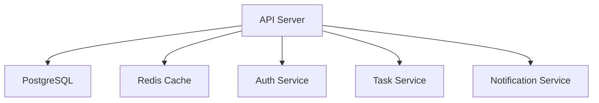
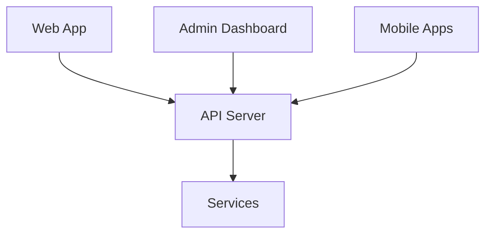
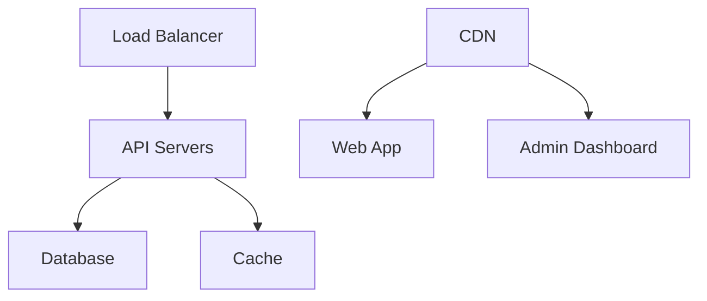

# System Architecture

The Tasks Application is built using a modern, scalable architecture with multiple components working together.

## High-Level Overview

<CardGroup cols={2}>
  <Card
    title="Backend Services"
    icon="server"
  >
    - Node.js API Server
    - PostgreSQL Database
    - Redis Cache
    - Authentication Service
  </Card>
  <Card
    title="Frontend Applications"
    icon="globe"
  >
    - Web Application (React)
    - Admin Dashboard (Next.js)
    - Mobile Apps (React Native)
  </Card>
</CardGroup>

## Component Architecture

### Backend Services

### Frontend Architecture

## Key Design Decisions

### 1. Monorepo Structure

We use a monorepo approach with pnpm workspaces for:
- Shared code and types
- Consistent dependency management
- Simplified development workflow

### 2. API Design

- RESTful API with OpenAPI specification
- JWT-based authentication
- Rate limiting and caching
- WebSocket support for real-time features

### 3. Database Design

- PostgreSQL for primary data storage
- Redis for caching and real-time features
- Database migrations for schema management

### 4. Frontend Architecture

- React for web applications
- Next.js for admin dashboard
- React Native for mobile apps
- Shared component library

## Security Considerations

- JWT-based authentication
- Role-based access control
- API rate limiting
- Input validation
- CORS configuration
- Secure headers

## Deployment Architecture

## Monitoring and Logging

- Application metrics
- Error tracking
- Performance monitoring
- Audit logging
- User activity tracking 