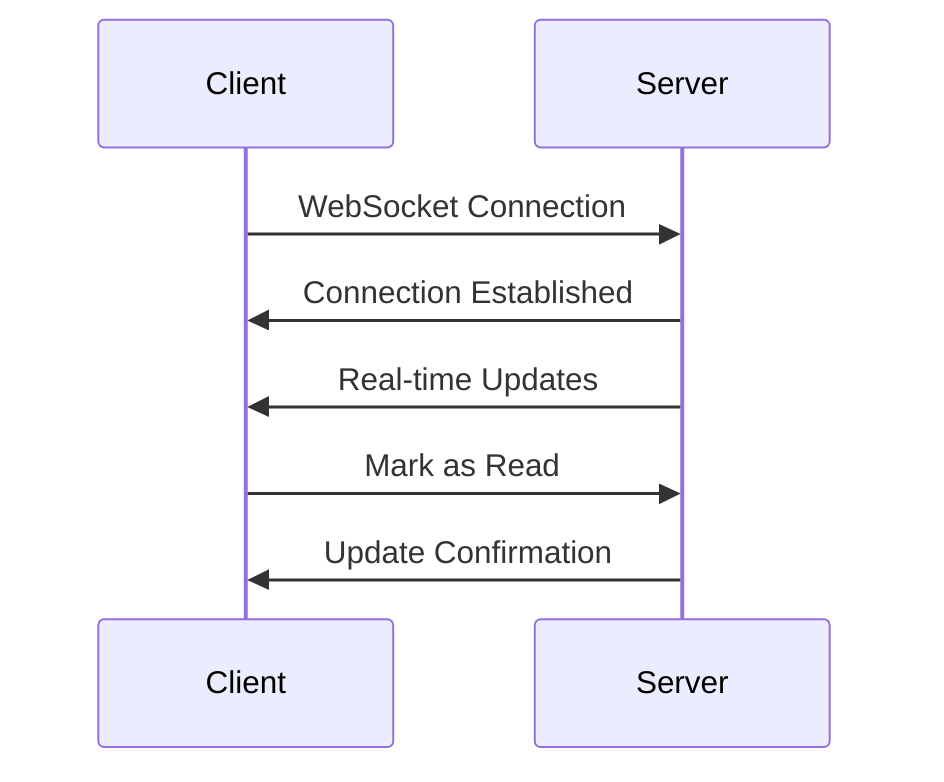

# Notifications

The Tasks Application includes a comprehensive notification system for real-time updates.

## Features

### 1. Notification Types

- Task assignments
- Due date reminders
- Status changes
- Comments and mentions
- System announcements
- Custom notifications

### 2. Delivery Channels

- In-app notifications
- Email notifications
- Push notifications (mobile)
- WebSocket real-time updates
- SMS (optional)

### 3. Notification Preferences

- Channel preferences
- Frequency settings
- Quiet hours
- Category-based filtering
- Custom rules

## Implementation

### WebSocket Connection

```typescript
// Connect to WebSocket
const ws = new WebSocket('ws://localhost:9000/ws');

// Listen for notifications
ws.onmessage = (event) => {
  const notification = JSON.parse(event.data);
  handleNotification(notification);
};
```

### Notification Structure

```typescript
interface Notification {
  id: string;
  type: 'task' | 'comment' | 'system';
  title: string;
  message: string;
  data: {
    taskId?: string;
    commentId?: string;
    userId?: string;
  };
  priority: 'high' | 'medium' | 'low';
  createdAt: Date;
  read: boolean;
}
```

## API Endpoints

### Notification Management

```typescript
// Get notifications
GET /api/notifications
GET /api/notifications?unread=true

// Mark as read
PATCH /api/notifications/:id/read
PATCH /api/notifications/read-all

// Update preferences
PATCH /api/notifications/preferences
{
  "email": true,
  "push": true,
  "inApp": true,
  "quietHours": {
    "start": "22:00",
    "end": "07:00"
  }
}
```

## Real-time Updates



## Notification Rules

```typescript
interface NotificationRule {
  event: string;
  conditions: {
    taskStatus?: string[];
    priority?: string[];
    assignee?: boolean;
  };
  actions: {
    channels: string[];
    template: string;
  };
}
```

## Best Practices

1. Batch notifications when possible
2. Respect user preferences
3. Implement notification grouping
4. Provide clear action buttons
5. Allow notification snoozing
6. Implement notification search
7. Regular notification cleanup

## Configuration

```typescript
// notification.config.ts
export const notificationConfig = {
  channels: {
    email: {
      enabled: true,
      templates: './templates/email'
    },
    push: {
      enabled: true,
      vapidKey: process.env.VAPID_KEY
    },
    websocket: {
      enabled: true,
      path: '/ws'
    }
  },
  batchInterval: 5 * 60 * 1000, // 5 minutes
  maxBatchSize: 10
}
```

<Note>
  For implementation details, check the [Backend Setup](/backend/setup) guide.
</Note> 