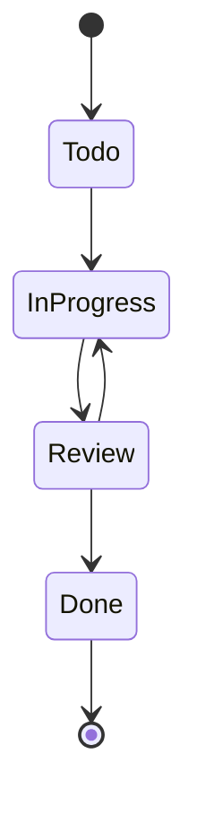
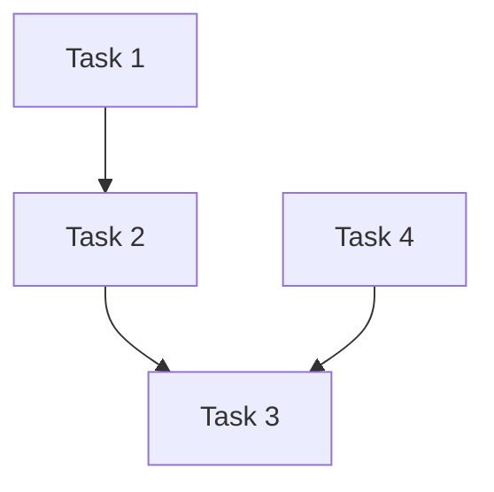

# Task Management

The Tasks Application provides comprehensive task management capabilities.

## Features

### 1. Task Operations

- Create, read, update, delete tasks
- Task assignment
- Due date management
- Priority levels
- Task categories
- Task status tracking

### 2. Task Organization

- Project grouping
- Labels and tags
- Custom fields
- Task dependencies
- Subtasks support

### 3. Collaboration

- Task sharing
- Comments and discussions
- File attachments
- Activity tracking
- Notifications

## API Endpoints

### Task Management

```typescript
// Create task
POST /api/tasks
{
  "title": "Implement authentication",
  "description": "Add JWT authentication",
  "dueDate": "2024-03-20",
  "priority": "high",
  "assignee": "user123"
}

// Get tasks
GET /api/tasks
GET /api/tasks?status=pending
GET /api/tasks?assignee=user123

// Update task
PATCH /api/tasks/:id
{
  "status": "in_progress",
  "priority": "medium"
}

// Delete task
DELETE /api/tasks/:id
```

### Task Categories

```typescript
// Get categories
GET /api/categories

// Create category
POST /api/categories
{
  "name": "Frontend",
  "color": "#FF5733"
}
```

## Task States



## Task Priority Levels

1. Critical (P0)
2. High (P1)
3. Medium (P2)
4. Low (P3)

## Task Dependencies



## Implementation Example

```typescript
interface Task {
  id: string;
  title: string;
  description?: string;
  status: 'todo' | 'in_progress' | 'review' | 'done';
  priority: 'critical' | 'high' | 'medium' | 'low';
  dueDate?: Date;
  assignee?: string;
  category?: string;
  labels: string[];
  dependencies: string[];
  createdAt: Date;
  updatedAt: Date;
}
```

## Best Practices

1. Keep task descriptions clear and concise
2. Use appropriate priority levels
3. Set realistic due dates
4. Regular status updates
5. Document task dependencies
6. Use labels for better organization
7. Regular task cleanup

<Note>
  For more details on task notifications, check the [Notifications](/features/notifications) section.
</Note> 